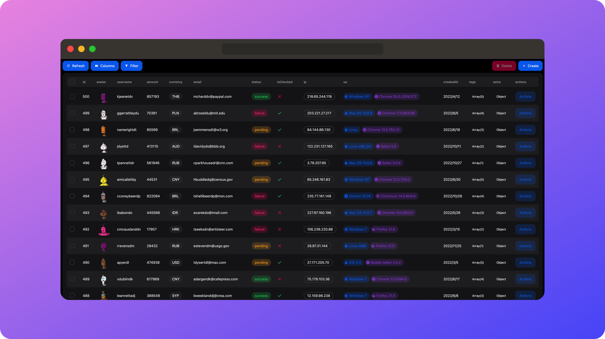

# NEXT-FAST-TABLE

🦄 一分钟制作你的表格程序



## 目录

1. [介绍](#介绍)
2. [功能特点](#功能特点)
3. [在线演示](#在线演示)
4. [安装](#安装)
5. [快速开始](#快速开始)
   - [创建 API 程序](#创建-api-程序)
   - [定义列并在页面中使用](#定义列并在页面中使用)
6. [配置选项](#配置选项)
   - [HelperConfig](#helperconfig)
   - [TableConfig](#tableconfig)
7. [类型](#类型)
8. [完整案例](#完整案例)
9. [FAQ](#FAQ)
10. [贡献和支持](#贡献和支持)
11. [License](#license)

## 介绍

**NEXT-FAST-TABLE** 是一个强大且高效的表格组件，专为使用 Next.js 的开发者设计。它简化了复杂数据展示的过程，使您能够在一分钟内快速创建和集成表格到您的应用程序中。

## 功能特点

- **🔥 易于使用**：利用 Server Action，无需定义接口，直接处理数据。当然，也可以使用 fetch 请求。
- **⭐️ 预设丰富**：只需调用 Fields.string()等方法，即可生成表单
- **🔧 高度可定制**：支持多种配置选项和样式自定义，满足不同应用场景的需求。
- **📱 响应式设计**：自动适配各种屏幕尺寸，提供最佳用户体验。
- **⚙️ 高级数据处理**：内置排序、筛选、分页、模糊搜索等功能，一键实现。
- **📊 数据种类齐全**：支持多种数据类型，包括文本、数字、日期、图片等。此外，还支持 JSON 和 Array

## 在线演示

<a href="https://next-fast-table.vercel.app" target="_blank" style="display: inline-block; background-color: #2563eb; color: white; padding: 10px 20px; text-align: center; text-decoration: none; border-radius: 5px; font-size: 12px; font-weight: bold;">
  DEMO
</a>

## 安装

使用你喜欢的包管理器轻松安装 NEXT-FAST-TABLE：

```bash
npm install next-fast-table
```

或

```bash
yarn add next-fast-table
```

或

```bash
pnpm install next-fast-table
```

## 快速开始

以下是一个简单的示例，展示如何在 Next.js 应用中使用 NEXT-FAST-TABLE

> 注意：这只是一个最小示例，实际应用中，您可以参考本项目的完整案例。

### 创建 API 程序

```typescript
"use server";
import {
  FetchParams,
  CreateParams,
  DeleteParams,
  UpdateParams,
} from "next-fast-table";

// 模拟数据库
let payments = [
  {
    id: 1,
    username: "John Doe",
    email: "john@example.com",
  },
  {
    id: 2,
    username: "Jane Smith",
    email: "jane@example.com",
  },
  {
    id: 3,
    username: "Alice",
    email: "alice@example.com",
  },
];

type Payment = {
  id: number;
  username: string;
  email: string;
};

// 获取数据
export async function onFetch(obj: FetchParams) {
  const pageSize = obj.pagination?.pageSize ?? 10;
  const pageIndex = obj.pagination?.pageIndex ?? 0;

  // 模拟排序
  const sortedPayments = payments.sort((a, b) => {
    if (!obj.sorting || obj.sorting.length === 0) return 0;
    const sort = obj.sorting[0];
    const multiplier = sort.desc ? -1 : 1;
    if (a[sort.id] < b[sort.id]) return -1 * multiplier;
    if (a[sort.id] > b[sort.id]) return 1 * multiplier;
    return 0;
  });

  // 模拟过滤
  const filteredPayments = sortedPayments.filter((payment) => {
    if (!obj.columnFilters || obj.columnFilters.length === 0) return true;
    return obj.columnFilters.every((filter) => {
      if (
        typeof filter.value === "number" ||
        typeof filter.value === "boolean"
      ) {
        return payment[filter.id] === filter.value;
      } else if (typeof filter.value === "string") {
        return payment[filter.id].includes(filter.value);
      }
      return false;
    });
  });

  const total = filteredPayments.length;
  const list = filteredPayments.slice(
    pageIndex * pageSize,
    (pageIndex + 1) * pageSize
  );

  return {
    list,
    total,
  };
}

// 创建数据
export async function onCreate(data: CreateParams<Payment>) {
  payments.push(data as any);
}

// 删除数据
export async function onDelete(data: DeleteParams<number>) {
  const idsToDelete = [data].flat().map((d) => d.id);
  payments = payments.filter((payment) => !idsToDelete.includes(payment.id));
}

// 更新数据
export async function onUpdate(data: UpdateParams<Payment>) {
  payments = payments.map((payment) =>
    payment.id === data.id ? { ...payment, ...data } : payment
  );
}
```

### 定义列并在页面中使用

```typescript
"use client";
import { NextFastTable, Fields } from "next-fast-table";
import { onCreate, onDelete, onFetch, onUpdate } from "YourAPIFile";

export default function DemoPage() {
  const field = Fields;

  const columns = [
    field.number("id"),
    field.string("username"),
    field.email("email"),
  ];

  return (
    <NextFastTable
      columns={columns}
      onFetch={onFetch}
      onDelete={onDelete}
      onCreate={onCreate}
      onUpdate={onUpdate}
    />
  );
}
```

## HelperConfig

这是一个用于控制前端表格渲染的配置选项。它提供了多种选项来控制表格的行为和数据操作。

### 配置选项

- **input**
  - `disabled`: 在编辑模式下（包括创建和编辑）输入是否禁用。默认值为 `false`。
  - `required`: 在编辑模式下输入是否必填，参与表单验证。默认值为 `false`。
- **list**
  - `hidden`: 列是否默认隐藏。如果为 `true`，则默认不显示，但可以通过列设置显示。默认值为 `false`。
- **其他选项**
  - `label`: 列的标签或别名。默认值为 `undefined`。
  - `enableHiding`: 是否允许隐藏。如果为 `false`，则不显示隐藏按钮。默认值为 `true`。
  - `enableSorting`: 是否允许排序。如果为 `false`，则不显示排序按钮。默认值为 `true`。
  - `enableColumnFilter`: 列是否参与列过滤。如果为 `false`，则不显示在列过滤中。默认值为 `true`。
  - `enum`: 枚举值，仅在使用 `field.enum` 时有效。默认值为 `[]`。
  - `render`: 用于在显示状态下自定义渲染的自定义渲染函数。
    - 参数:
      - `cell`: 单元格的值。
      - `row`: 行数据。
    - 返回值: 用于渲染的 JSX 元素或字符串。

## TableConfig

`TableConfig` 是 NextFastTable 组件的传参类型，其中 `columns` 和 `onFetch` 是必填的。

### 配置选项

- **name**
  - **描述**: 表格的名称，用于生成 `tanstack-query` 的键。
  - **默认值**: `'next-table'`
- **columns**
  - **描述**: 表格的列配置。
  - **必填**: 是
- **onFetch**
  - **描述**: 用于获取表格数据的函数。
  - **参数**:
    - `args`: 包含分页、排序和列过滤器的对象。
  - **返回值**: 一个包含总项目数和数据列表（带 ID）的 Promise。
  - **示例**:
    ```javascript
    async function fetchData({ pagination, sorting, columnFilters }) {
      const data = await fetchDataFromAPI({
        pagination,
        sorting,
        columnFilters,
      });
      const total = await fetchTotalCount();
      return {
        list: data,
        total,
      };
    }
    ```
- **onDelete**
  - **描述**: 用于删除数据的函数。
  - **可选**: 是
  - **参数**:
    - `data`: 要删除的数据，可以是单个 ID 或 ID 数组。
  - **返回值**: 一个在删除完成时解析的 Promise。
  - **示例**:
    ```javascript
    async function deleteData(data) {
      await deleteDataFromAPI(data);
    }
    ```
- **onCreate**
  - **描述**: 用于创建新数据的函数。
  - **可选**: 是
  - **参数**:
    - `data`: 要创建的数据。
  - **返回值**: 一个在创建完成时解析的 Promise。
  - **示例**:
    ```javascript
    async function createData(data) {
      const newData = await createDataInAPI(data);
      return newData;
    }
    ```
- **onUpdate**
  - **描述**: 用于更新现有数据的函数。
  - **可选**: 是
  - **参数**:
    - `data`: 要更新的数据。仅发送 ID 和要更新的字段。
  - **返回值**: 一个在更新完成时解析的 Promise。
  - **示例**:
    ```javascript
    async function updateData(data) {
      const updatedData = await updateDataInAPI(data);
      return updatedData;
    }
    ```

## 类型

```typescript
type DataWithID<T = Record<string, any>> = {
  id: number | string;
} & Partial<T>;

type DataOnlyId<T = number | string> = {
  id: T;
};

export type FetchParams = {
  pagination?: { pageSize: number; pageIndex: number };
  sorting?: { id: string; desc: boolean }[];
  columnFilters?: { id: string; value: any }[];
};

export type DeleteParams<T> = DataOnlyId<T> | DataOnlyId<T>[];

export type UpdateParams<T = Record<string, any>> = DataWithID<T>;

export type CreateParams<T = Record<string, any>> = DataWithID<T>;
```

## 完整案例

本项目是一个最小化的 Next.js 应用，用于演示 NEXT-FAST-TABLE 的基本用法。您可以通过以下步骤在本地运行该项目。该项目使用 sqlite 数据库，数据存储在 `prisma/data.db` 文件中。

```bash
git clone https://github.com/Haiananan/next-fast-table.git
npm install
npm run dev
```

## FAQ

### 这是一个后台管理模板吗？

不。NEXT-FAST-TABLE 是一个表格组件，用于展示数据。它不包含任何后台管理模板。它旨在帮助开发者快速构建表格页面，而不是一套完整的后台管理系统。

### 为什么选择 NEXT-FAST-TABLE？

NEXT-FAST-TABLE 是一个高效且易于使用的表格组件，专为 Next.js 开发者设计。它提供了丰富的配置选项和数据操作方法，使您能够快速创建和集成表格到您的应用程序中。得益于天然的 Server Action，您无需定义接口，可以直接处理数据。

### 只能使用 Server Action 吗？

不是的。你可以使用任何方式（axios,fetch...）获取数据，只要保证以规定结构返回即可。如果请求失败，需要抛出一个错误。

### 只能在 Nextjs 中使用吗？

不是的。NEXT-FAST-TABLE 是一个独立的组件，可以在任何 React 项目中使用。但是，由于它使用了 Server Action，所以在其他框架中使用时，需要自行实现数据获取。

### 为什么使用 NextUI 而不是其他 UI 库？

NextUI 是一个优秀的 UI 库，提供了丰富的组件和主题，可以快速搭建页面。本项目重点关注全栈开发者的使用体验，并且提供了十分优秀的触摸反馈，适合移动端使用。我们关注于简单且极致的操作体验，而 NextUI 正是我们所需要的。

## 贡献和支持

欢迎贡献代码和提交问题。您可以在 [GitHub 仓库](https://github.com/Haiananan/next-fast-table) 提交 Pull Request 或 Issue。

本地运行项目：

```bash
git clone https://github.com/Haiananan/next-fast-table.git
pnpm install
cd package
pnpm install
cd ..
pnpm dev
```

打包：

```bash
cd package
pnpm build
```

## License

本项目使用 MIT 许可证。请查看 [LICENSE](./LICENSE) 文件获取更多信息。
