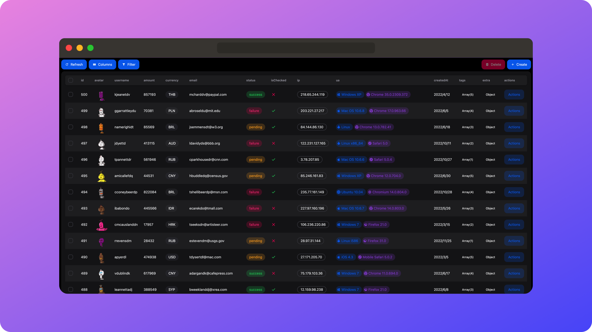

# NEXT-FAST-TABLE

🦄 **NEXT-FAST-TABLE** is an atomic, out-of-the-box frontend form component for backend management applications, based on Next.js.



[Engligh](./README.md) | [中文](./README.cn.md)


## Table of Contents

1. [Introduction](#introduction)
2. [Features](#features)
3. [Online Demo](#online-demo)
4. [Installation](#installation)
5. [Quick Start](#quick-start)
   - [Create API Program](#create-api-program)
   - [Define Columns and Use in Page](#define-columns-and-use-in-page)
6. [Configuration Options](#configuration-options)
   - [HelperConfig](#helperconfig)
   - [TableConfig](#tableconfig)
7. [Types](#types)
8. [Complete Example](#complete-example)
9. [WHY NEXT-FAST-TABLE](#why-next-fast-table)
10. [Contribution and Support](#contribution-and-support)
11. [License](#license)

## Introduction

**NEXT-FAST-TABLE** is a powerful and efficient table component designed for developers using Next.js. It simplifies the process of displaying complex data, allowing you to quickly create and integrate tables into your application within minutes.

As an independent developer, you can rapidly create a functional backend management framework similar to calling a library. It includes common CRUD operations and typical requirements like filtering and exporting. With NEXT-FAST-TABLE, you can focus more on core business logic rather than backend management. This tool enables independent developers, especially those using Next.js, to develop and deploy a functional backend management MVP in minutes rather than hours.

## Features

- **🔥 Easy to Use**: Utilize Server Action for data handling without defining APIs explicitly. Alternatively, use fetch requests.
- **⭐️ Rich Presets**: Easily generate forms by calling methods like Fields.string().
- **🔧 Highly Customizable**: Supports various configuration options and style customization to meet diverse application needs.
- **📱 Responsive Design**: Automatically adapts to various screen sizes, providing the best user experience.
- **⚙️ Advanced Data Handling**: Built-in functionalities such as sorting, filtering, pagination, and fuzzy search for seamless integration.
- **📊 Comprehensive Data Types**: Supports multiple data types including text, numbers, dates, images, JSON, and Arrays.

## Online Demo

<a href="https://next-fast-table.vercel.app" target="_blank" style="display: inline-block; background-color: #2563eb; color: white; padding: 10px 20px; text-align: center; text-decoration: none; border-radius: 5px; font-size: 12px; font-weight: bold;">
  DEMO
</a>

## Installation

Easily install NEXT-FAST-TABLE using your preferred package manager:

```bash
npm install next-fast-table
```

or

```bash
yarn add next-fast-table
```

or

```bash
pnpm install next-fast-table
```

## Quick Start

Here's a simple example demonstrating how to use NEXT-FAST-TABLE in a Next.js application.

> Note: This is a minimal example. Refer to the full example in the project for detailed usage.

### Create API Program

```typescript
"use server";
import {
  FetchParams,
  CreateParams,
  DeleteParams,
  UpdateParams,
} from "next-fast-table";

// Simulated database
let payments = [
  {
    id: 1,
    username: "John Doe",
    email: "john@example.com",
  },
  {
    id: 2,
    username: "Jane Smith",
    email: "jane@example.com",
  },
  {
    id: 3,
    username: "Alice",
    email: "alice@example.com",
  },
];

type Payment = {
  id: number;
  username: string;
  email: string;
};

// Fetch data
export async function onFetch(obj: FetchParams) {
  const pageSize = obj.pagination?.pageSize ?? 10;
  const pageIndex = obj.pagination?.pageIndex ?? 0;

  // Simulated sorting
  const sortedPayments = payments.sort((a, b) => {
    if (!obj.sorting || obj.sorting.length === 0) return 0;
    const sort = obj.sorting[0];
    const multiplier = sort.desc ? -1 : 1;
    if (a[sort.id] < b[sort.id]) return -1 * multiplier;
    if (a[sort.id] > b[sort.id]) return 1 * multiplier;
    return 0;
  });

  // Simulated filtering
  const filteredPayments = sortedPayments.filter((payment) => {
    if (!obj.columnFilters || obj.columnFilters.length === 0) return true;
    return obj.columnFilters.every((filter) => {
      if (
        typeof filter.value === "number" ||
        typeof filter.value === "boolean"
      ) {
        return payment[filter.id] === filter.value;
      } else if (typeof filter.value === "string") {
        return payment[filter.id].includes(filter.value);
      }
      return false;
    });
  });

  const total = filteredPayments.length;
  const list = filteredPayments.slice(
    pageIndex * pageSize,
    (pageIndex + 1) * pageSize
  );

  return {
    list,
    total,
  };
}

// Create data
export async function onCreate(data: CreateParams<Payment>) {
  payments.push(data as any);
}

// Delete data
export async function onDelete(data: DeleteParams<number>) {
  const idsToDelete = [data].flat().map((d) => d.id);
  payments = payments.filter((payment) => !idsToDelete.includes(payment.id));
}

// Update data
export async function onUpdate(data: UpdateParams<Payment>) {
  payments = payments.map((payment) =>
    payment.id === data.id ? { ...payment, ...data } : payment
  );
}
```

### Define Columns and Use in Page

```typescript
"use client";
import { NextFastTable, Fields } from "next-fast-table";
import { onCreate, onDelete, onFetch, onUpdate } from "YourAPIFile";

export default function DemoPage() {
  const field = Fields;

  const columns = [
    field.number("id"),
    field.string("username"),
    field.email("email"),
  ];

  return (
    <NextFastTable
      columns={columns}
      onFetch={onFetch}
      onDelete={onDelete}
      onCreate={onCreate}
      onUpdate={onUpdate}
    />
  );
}
```

## HelperConfig

This configures front-end table rendering behavior. It offers multiple options to control table actions and data operations.

### Configuration Options

- **input**
  - `disabled`: Whether input is disabled in edit mode (including create and update). Default is `false`.
  - `required`: Whether input is required in edit mode, participating in form validation. Default is `false`.
- **list**
  - `hidden`: Whether the column is hidden by default. If `true`, it's not displayed by default but can be shown through column settings. Default is `false`.
- **Other Options**
  - `label`: Label or alias for the column. Default is `undefined`.
  - `enableHiding`: Whether hiding is enabled. If `false`, hide button is not displayed. Default is `true`.
  - `enableSorting`: Whether sorting is enabled. If `false`, sorting button is not displayed. Default is `true`.
  - `enableColumnFilter`: Whether the column participates in column filtering. If `false`, it's not displayed in column filters. Default is `true`.
  - `enum`: Enum values, valid only when using `field.enum`. Default is `[]`.
  - `render`: Custom rendering function for display state.
    - Parameters:
      - `cell`: Value of the cell.
      - `row`: Row data.
    - Returns: JSX element or string used for rendering.

## TableConfig

`TableConfig` is the prop type for the NextFastTable component, where `columns` and `onFetch` are required.

### Configuration Options

- **name**
  - **Description**: Name of the table used for generating `tanstack-query` keys.
  - **Default**: `'next-table'`
- **columns**
  - **Description**: Configuration of table columns.
  - **Required**: Yes
- **onFetch**
  - **Description**: Function used to fetch table data.
  - **Parameters**:
    - `args`: Object containing pagination, sorting, and column filters.
  - **Returns**: Promise containing total items and data list (with ID).
  - **Example**:
    ```javascript
    async function fetchData({ pagination, sorting, columnFilters }) {
      const data = await fetchDataFromAPI({
        pagination,
        sorting,
        columnFilters,
      });
      const total = await fetchTotalCount();
      return {
        list: data,
        total,
      };
    }
    ```
- **onDelete**
  - **Description**: Function used to delete data.
  - **Optional**: Yes
  - **Parameters**:
    - `data`: Data to delete, can be single ID or array of IDs.
  - **Returns**: Promise resolved when deletion is completed.
  - **Example**:
    ```javascript
    async function deleteData(data) {
      await deleteDataFromAPI(data);
    }
    ```
- **onCreate**
  - **Description**: Function used to create new data.
  - **Optional**: Yes
  - **Parameters**:
    - `data`: Data to create.
  - **Returns**: Promise resolved when creation is completed.
  - **Example**:
    ```javascript
    async function createData(data) {
      const newData = await createDataInAPI(data);
      return newData;
    }
    ```
- **onUpdate**
  - **Description**: Function used to update existing data.
  - **Optional**: Yes
  - **Parameters**:
    - `data`: Data to update. Send only ID and fields to update.
  - **Returns**: Promise resolved when update is completed.
  - **Example**:
    ```javascript
    async function updateData(data) {
      const updatedData = await updateDataInAPI(data);
      return updatedData;
    }
    ```

## Types

```typescript
type DataWithID<T = Record<string, any>> = {
  id: number | string;
} & Partial<T>;

type DataOnlyId<T = number | string> = {
  id: T;
};

export type FetchParams = {
  pagination?: { pageSize: number; pageIndex: number };
  sorting?: { id: string; desc: boolean }[];
  columnFilters?: { id: string; value: any }[];
};

export type DeleteParams<T> = DataOnlyId<T> | DataOnlyId<T>[];

export type UpdateParams<T = Record<string, any>> = DataWithID<T>;

export type CreateParams<T = Record<string, any>> = DataWithID<T>;
```

## Complete Example

This project is a minimal Next.js application demonstrating basic usage of NEXT-FAST-TABLE. You can run the project locally using the following steps. The project uses sqlite database, with data stored in `prisma/data.db` file.

```bash
git clone https://github.com/Haiananan/next-fast-table.git

npm install
cd package
npm install
cd ..

npx prisma db push
npx prisma db seed
npx prisma generate
npm run dev
```

## WHY NEXT-FAST-TABLE

### Who Should Use It

1. Individual developers who want to set up a functional data panel within minutes.
2. Individual developers or teams building demos or various MVP services.
3. Next.js developers.

### Development Motivation

In software development, backend application development is a crucial phase, but many developers find it tedious. The primary reason is that backend application development often involves repetitive CRUD operations and some minor special logic, which can feel like a waste of time and energy.

We can abstract UI requirements into design components, so why not abstract backend requirements into an out-of-the-box library? This not only reduces repetitive labor but also enhances development efficiency, allowing developers to focus on more creative tasks.

#### Subtraction Is Always Harder Than Addition

Currently, there are many ready-made, complete admin application templates in the market. These applications provide a full stack of technologies, allowing developers to start them with a command and adjust them according to their needs. However, are these systems really easy to use? Faced with a complete and large system, many people feel overwhelmed and need to spend a lot of time learning documentation and reading source code. Many beginners may think it's their own ability issue, but in fact, it's not the developer's own problem.

Subtraction is always harder than addition. Most systems on the market are complete applications that require developers to subtract to fit their own needs. However, when the requirements exceed the preset framework, these systems can lead to a lot of technical debt. Technical debt often stems from differences in the design purposes of the system's early and late stages. Ready-made systems cannot fully match the requirements of secondary development, so many developers are unwilling to engage in secondary development, which may eventually lead to refactoring or even starting from scratch.

#### Sometimes Less Is More Important Than Good

After using NEXT-FAST-TABLE, I can integrate all the basic CRUD operations required by a model within 1 minute (no kidding :D), and I only need to modify the logic slightly, leaving the rest to define columns.

For independent developers, NEXT-FAST-TABLE can save several hours in building basic backend management panels, allowing developers to focus more on developing business logic. Rather than slowly modifying a complete and large admin project, it's better to build what you need from scratch! This is a simple, pure, fast backend management tool component designed with empathy for independent developers (rather than using various database tools to manage their own SaaS).

#### Atomic

NEXT-FAST-TABLE is just a tool library for forms, you can integrate it into any existing system and freely expand it. Because the most complicated form CRUD content, it has been set up for you!

### Why Develop Based on Next.js

In other admin panel projects, you not only need to define various column data but also need to define many APIs for network request operations and use fetch or axios. However, with the support of Next.js's Server Actions, you can work without having to integrate APIs, just define a few functions and pass them into client components, and also have TypeScript type hints. When your business data structure changes, you only need to modify column definitions and related functions, which can generally be completed within a minute!

### Can Only Server Actions Be Used?

No. You can use any method (axios, fetch, etc.) to get data, just ensure that it returns in the specified structure. If the request fails, an error needs to be thrown.

### Can It Only Be Used in Next.js?

No. NEXT-FAST-TABLE is a standalone component that can be used in any React project. However, because it uses Server Actions, when used in other frameworks, data retrieval needs to be implemented independently.

### Why Use NextUI Instead of Other UI Libraries?

NextUI is an excellent UI library that provides a rich set of components and themes for quickly building pages. This project focuses on the user experience of full-stack developers and provides excellent touch feedback, suitable for mobile use. We focus on simple and ultimate operational experience, and NextUI is exactly what we need. Many component libraries pursue comprehensiveness but overlook the refinement of details, such as press touch feedback and animation effects. Because NEXT-FAST-TABLE is a simple and fast backend panel tool component, it requires a small and beautiful exquisite UI.

## Contribution and Support

Contributions and issue submissions are welcome. You can submit a Pull Request or Issue on [GitHub repository](https://github.com/Haiananan/next-fast-table).

Run the project locally:

```bash
git clone https://github.com/Haiananan/next-fast-table.git
pnpm install
cd package
pnpm install
cd ..
pnpm dev
```

Build:

```bash
cd package
pnpm build
```

## License

This project is licensed under the MIT License. Please see the [LICENSE](./LICENSE) file for more information.
