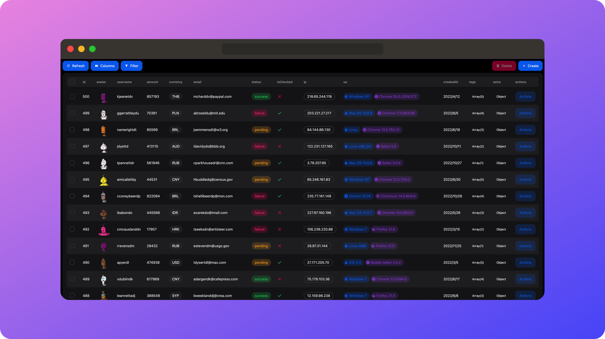

# NEXT-FAST-TABLE

🦄 Create Your Table Program in One Minute



[Engligh](./README.md) | [中文](./README.cn.md)


## Table of Contents

1. [Introduction](#introduction)
2. [Features](#features)
3. [Online Demo](#online-demo)
4. [Installation](#installation)
5. [Quick Start](#quick-start)
   - [Create API Program](#create-api-program)
   - [Define Columns and Use in Page](#define-columns-and-use-in-page)
6. [Configuration Options](#configuration-options)
   - [HelperConfig](#helperconfig)
   - [TableConfig](#tableconfig)
7. [Types](#types)
8. [Complete Example](#complete-example)
9. [FAQ](#faq)
10. [Contribution and Support](#contribution-and-support)
11. [License](#license)

## Introduction

**NEXT-FAST-TABLE** is a powerful and efficient table component designed for developers using Next.js. It simplifies the process of displaying complex data, allowing you to quickly create and integrate tables into your applications in just one minute.

## Features

- **🔥 Easy to Use**: Utilize Server Action for data handling without defining APIs explicitly. Alternatively, use fetch requests.
- **⭐️ Rich Presets**: Easily generate forms by calling methods like Fields.string().
- **🔧 Highly Customizable**: Supports various configuration options and style customization to meet diverse application needs.
- **📱 Responsive Design**: Automatically adapts to various screen sizes, providing the best user experience.
- **⚙️ Advanced Data Handling**: Built-in functionalities such as sorting, filtering, pagination, and fuzzy search for seamless integration.
- **📊 Comprehensive Data Types**: Supports multiple data types including text, numbers, dates, images, JSON, and Arrays.

## Online Demo

<a href="https://next-fast-table.vercel.app" target="_blank" style="display: inline-block; background-color: #2563eb; color: white; padding: 10px 20px; text-align: center; text-decoration: none; border-radius: 5px; font-size: 12px; font-weight: bold;">
  DEMO
</a>

## Installation

Easily install NEXT-FAST-TABLE using your preferred package manager:

```bash
npm install next-fast-table
```

or

```bash
yarn add next-fast-table
```

or

```bash
pnpm install next-fast-table
```

## Quick Start

Here's a simple example demonstrating how to use NEXT-FAST-TABLE in a Next.js application.

> Note: This is a minimal example. Refer to the full example in the project for detailed usage.

### Create API Program

```typescript
"use server";
import {
  FetchParams,
  CreateParams,
  DeleteParams,
  UpdateParams,
} from "next-fast-table";

// Simulated database
let payments = [
  {
    id: 1,
    username: "John Doe",
    email: "john@example.com",
  },
  {
    id: 2,
    username: "Jane Smith",
    email: "jane@example.com",
  },
  {
    id: 3,
    username: "Alice",
    email: "alice@example.com",
  },
];

type Payment = {
  id: number;
  username: string;
  email: string;
};

// Fetch data
export async function onFetch(obj: FetchParams) {
  const pageSize = obj.pagination?.pageSize ?? 10;
  const pageIndex = obj.pagination?.pageIndex ?? 0;

  // Simulated sorting
  const sortedPayments = payments.sort((a, b) => {
    if (!obj.sorting || obj.sorting.length === 0) return 0;
    const sort = obj.sorting[0];
    const multiplier = sort.desc ? -1 : 1;
    if (a[sort.id] < b[sort.id]) return -1 * multiplier;
    if (a[sort.id] > b[sort.id]) return 1 * multiplier;
    return 0;
  });

  // Simulated filtering
  const filteredPayments = sortedPayments.filter((payment) => {
    if (!obj.columnFilters || obj.columnFilters.length === 0) return true;
    return obj.columnFilters.every((filter) => {
      if (
        typeof filter.value === "number" ||
        typeof filter.value === "boolean"
      ) {
        return payment[filter.id] === filter.value;
      } else if (typeof filter.value === "string") {
        return payment[filter.id].includes(filter.value);
      }
      return false;
    });
  });

  const total = filteredPayments.length;
  const list = filteredPayments.slice(
    pageIndex * pageSize,
    (pageIndex + 1) * pageSize
  );

  return {
    list,
    total,
  };
}

// Create data
export async function onCreate(data: CreateParams<Payment>) {
  payments.push(data as any);
}

// Delete data
export async function onDelete(data: DeleteParams<number>) {
  const idsToDelete = [data].flat().map((d) => d.id);
  payments = payments.filter((payment) => !idsToDelete.includes(payment.id));
}

// Update data
export async function onUpdate(data: UpdateParams<Payment>) {
  payments = payments.map((payment) =>
    payment.id === data.id ? { ...payment, ...data } : payment
  );
}
```

### Define Columns and Use in Page

```typescript
"use client";
import { NextFastTable, Fields } from "next-fast-table";
import { onCreate, onDelete, onFetch, onUpdate } from "YourAPIFile";

export default function DemoPage() {
  const field = Fields;

  const columns = [
    field.number("id"),
    field.string("username"),
    field.email("email"),
  ];

  return (
    <NextFastTable
      columns={columns}
      onFetch={onFetch}
      onDelete={onDelete}
      onCreate={onCreate}
      onUpdate={onUpdate}
    />
  );
}
```

## HelperConfig

This configures front-end table rendering behavior. It offers multiple options to control table actions and data operations.

### Configuration Options

- **input**
  - `disabled`: Whether input is disabled in edit mode (including create and update). Default is `false`.
  - `required`: Whether input is required in edit mode, participating in form validation. Default is `false`.
- **list**
  - `hidden`: Whether the column is hidden by default. If `true`, it's not displayed by default but can be shown through column settings. Default is `false`.
- **Other Options**
  - `label`: Label or alias for the column. Default is `undefined`.
  - `enableHiding`: Whether hiding is enabled. If `false`, hide button is not displayed. Default is `true`.
  - `enableSorting`: Whether sorting is enabled. If `false`, sorting button is not displayed. Default is `true`.
  - `enableColumnFilter`: Whether the column participates in column filtering. If `false`, it's not displayed in column filters. Default is `true`.
  - `enum`: Enum values, valid only when using `field.enum`. Default is `[]`.
  - `render`: Custom rendering function for display state.
    - Parameters:
      - `cell`: Value of the cell.
      - `row`: Row data.
    - Returns: JSX element or string used for rendering.

## TableConfig

`TableConfig` is the prop type for the NextFastTable component, where `columns` and `onFetch` are required.

### Configuration Options

- **name**
  - **Description**: Name of the table used for generating `tanstack-query` keys.
  - **Default**: `'next-table'`
- **columns**
  - **Description**: Configuration of table columns.
  - **Required**: Yes
- **onFetch**
  - **Description**: Function used to fetch table data.
  - **Parameters**:
    - `args`: Object containing pagination, sorting, and column filters.
  - **Returns**: Promise containing total items and data list (with ID).
  - **Example**:
    ```javascript
    async function fetchData({ pagination, sorting, columnFilters }) {
      const data = await fetchDataFromAPI({
        pagination,
        sorting,
        columnFilters,
      });
      const total = await fetchTotalCount();
      return {
        list: data,
        total,
      };
    }
    ```
- **onDelete**
  - **Description**: Function used to delete data.
  - **Optional**: Yes
  - **Parameters**:
    - `data`: Data to delete, can be single ID or array of IDs.
  - **Returns**: Promise resolved when deletion is completed.
  - **Example**:
    ```javascript
    async function deleteData(data) {
      await deleteDataFromAPI(data);
    }
    ```
- **onCreate**
  - **Description**: Function used to create new data.
  - **Optional**: Yes
  - **Parameters**:
    - `data`: Data to create.
  - **Returns**: Promise resolved when creation is completed.
  - **Example**:
    ```javascript
    async function createData(data) {
      const newData = await createDataInAPI(data);
      return newData;
    }
    ```
- **onUpdate**
  - **Description**: Function used to update existing data.
  - **Optional**: Yes
  - **Parameters**:
    - `data`: Data to update. Send only ID and fields to update.
  - **Returns**: Promise resolved when update is completed.
  - **Example**:
    ```javascript
    async function updateData(data) {
      const updatedData = await updateDataInAPI(data);
      return updatedData;
    }
    ```

## Types

```typescript
type DataWithID<T = Record<string, any>> = {
  id: number | string;
} & Partial<T>;

type DataOnlyId<T = number | string> = {
  id: T;
};

export type FetchParams = {
  pagination?: { pageSize: number; pageIndex: number };
  sorting?: { id: string; desc: boolean }[];
  columnFilters?: { id: string; value: any }[];
};

export type DeleteParams<T> = DataOnlyId<T> | DataOnlyId<T>[];

export type UpdateParams<T = Record<string, any>> = DataWithID<T>;

export type CreateParams<T = Record<string, any>> = DataWithID<T>;
```

## Complete Example

This project is a minimal Next.js application demonstrating basic usage of NEXT-FAST-TABLE. You can run the project locally using the following steps. The project uses sqlite database, with data stored in `prisma/data.db` file.

```bash
git clone https://github.com/Haiananan/next-fast-table.git
npm install
cd package
npm install
cd ..
npm run dev
```

## FAQ

### Is this a backend admin template?

No. NEXT-FAST-TABLE is a table component designed for data presentation. It does not include any backend admin template. It aims to assist developers in quickly building table pages rather than a complete backend admin system.

### Why choose NEXT-FAST-TABLE?

NEXT-FAST-TABLE is an efficient and easy-to-use table component designed for Next.js developers. It provides rich configuration options and data handling methods, enabling you to quickly create and integrate tables into your applications. Leveraging Server Action by default, you can handle data without explicitly defining APIs.

### Can I only use Server Action?

No. You can fetch data using any method (axios, fetch, etc.) as long as you return data in the specified structure. If the request fails, an error should be thrown.

### Can it only be used in Next.js?

No. NEXT-FAST-TABLE is a standalone component and can be used in any React project. However, due to its use of Server Action, you'll need to implement data fetching when using it in other frameworks.

### Why use NextUI instead of other UI libraries?

NextUI is an excellent UI library offering a rich set of components and themes for rapid page development. This project focuses on providing a great user experience for full-stack developers, emphasizing simple and refined operation experiences, which NextUI excels in providing.

## Contribution and Support

Contributions and issue submissions are welcome. You can submit a Pull Request or Issue on [GitHub repository](https://github.com/Haiananan/next-fast-table).

Run the project locally:

```bash
git clone https://github.com/Haiananan/next-fast-table.git
pnpm install
cd package
pnpm install
cd ..
pnpm dev
```

Build:

```bash
cd package
pnpm build
```

## License

This project is licensed under the MIT License. Please see the [LICENSE](./LICENSE) file for more information.
